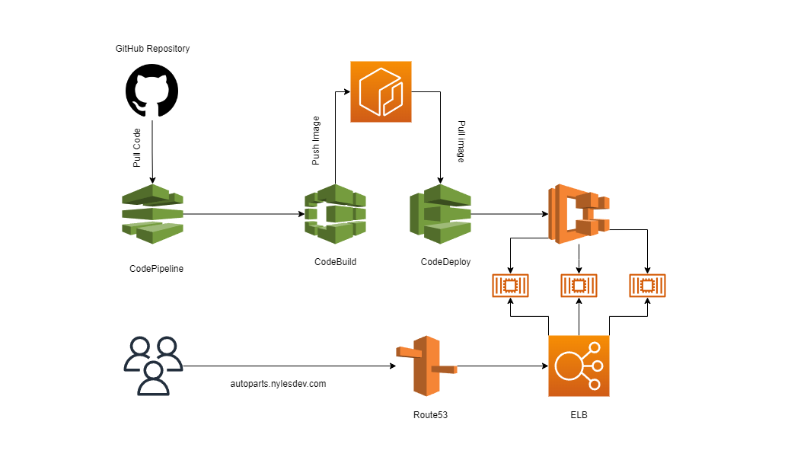

# AutoMate - Auto Sales Website Project

Platform for car rental, purchase accross Seattle.

This project serves as a real-life auto dealer website where customers can find the right car they're looking for.
The website is able to store a wide range of car types (used, new), model (SUV, Convertible, Coupe 4S, etc.)

<h2>Tech Stack Used:</h2>

Mongodb ExpressJS React Nodejs RabbitMQ

<h2>CI/CD Pipeline:</h2>
<ul>
  <li>AWS CodeCommit</li>
  <li>AWS CodeBuild</li>
  <li>AWS CodeDeploy</li>
  <li>AWS CodePipeline</li>
  <li>AWS ECS with Fargate</li>
  <li>Route53, ALB </li>
</ul>

